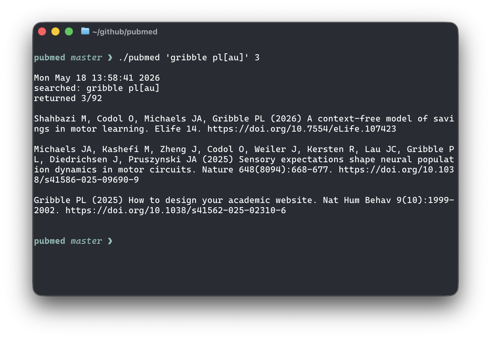
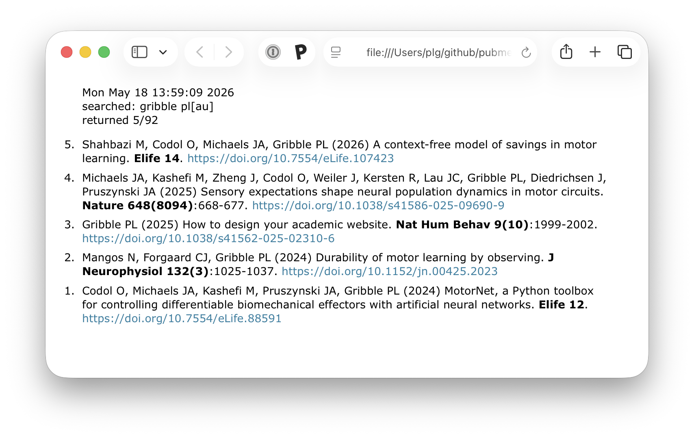

# pubmed

C code for searching PubMed.

Dependencies: libcurl and libxml2.

## Building

Requires libcurl and libxml2 (both with development headers), `pkg-config`, and a C99 compiler.

### macOS (Homebrew)

```
brew install libxml2 pkg-config
export PKG_CONFIG_PATH="$(brew --prefix libxml2)/lib/pkgconfig"
make
```

(libcurl ships with the Xcode Command Line Tools.)

### Linux (Debian/Ubuntu)

```
sudo apt-get install build-essential pkg-config libcurl4-openssl-dev libxml2-dev
make
```

## Usage

Retrieve the 3 most recent articles by P.L. Gribble and print them to the screen:

```
./pubmed 'gribble pl[au]' 3
```



Retrieve the 5 most recent articles by P.L. Gribble, write the list to
`gribble.html` in pretty HTML format, and open it in a browser (macOS):

```
./pubmed 'gribble pl[au]' 5 1 > gribble.html && open gribble.html
```


