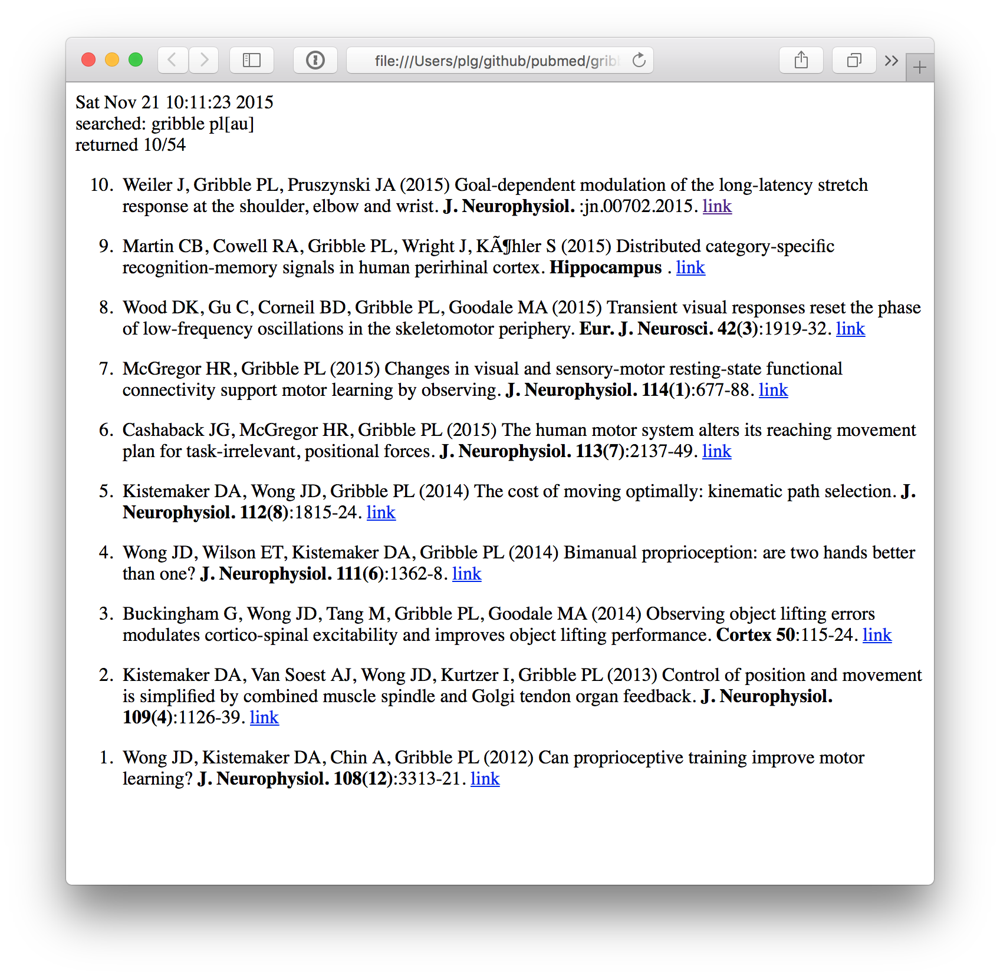

# pubmed
C code for searching PubMed
(work in progress)
there are some memory leaks, I'm working on it

dependencies: libcurl and libxml2

usage examples:

retrieve 3 most recent articles by P.L. Gribble and print them to the screen:

```
./pubmed 'gribble pl[au]' 3
```


retrieve 10 most recent articles by P.L. Gribble, and write the list
	 to a file called gribble.html in pretty html format, and then
	 open that file in a web browser (works on a mac):

```
./pubmed 'gribble pl[au]' 10 1 > gribble.html ; open gribble.html
```


